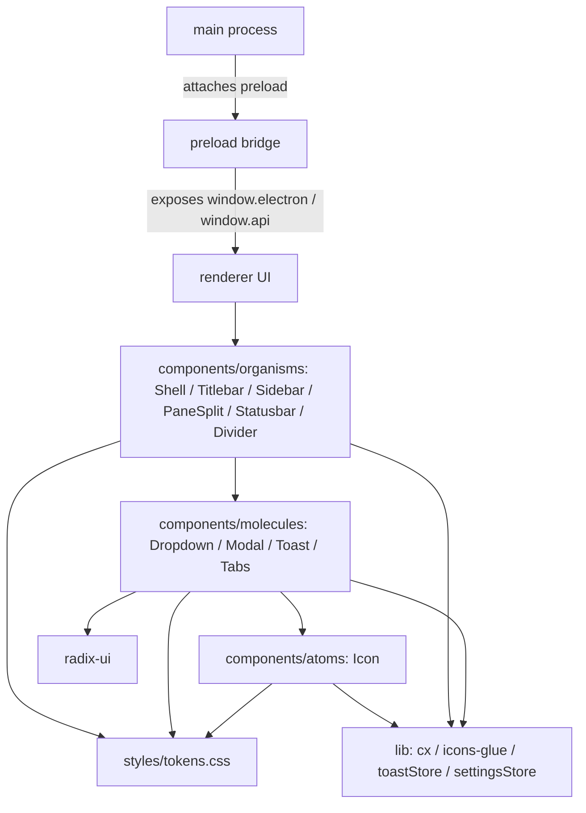

# Architecture — mintenvoy

> Commands named in backticks (e.g. `constitute`, `onboard`) are invoked with the `/` prefix in Claude Code (e.g. `/constitute`).
>
> **Project**: mintenvoy — see the project primer (`CLAUDE.md`) for stack facts (language, framework, build/lint/typecheck commands) and, for multi-package projects, the `## Packages` table with per-package detail. This file captures architectural **decisions, rules, and flow** — the "why" behind the setup, not the "what".

---

## Architectural Decisions

_Populated by `constitute` — records WHY decisions were made, not just what. Format: **Decision** — rationale + tradeoffs considered._

## Layer Boundaries & Dependency Rules

_Populated by `constitute` (for new/greenfield projects — chosen patterns) or `onboard` (for brownfield projects — extracted from existing code). Documents which layers exist, what imports from what, and which directions are forbidden._

### Renderer — UI Primitives Layer (established by feature 001-ui-primitives)

The renderer process has a three-sublayer structure beneath feature components:

| Sublayer                 | Contents                                                                                                                                                                                                                          | Path                                      |
| ------------------------ | --------------------------------------------------------------------------------------------------------------------------------------------------------------------------------------------------------------------------------- | ----------------------------------------- |
| Presentation — atoms     | Inline SVG `Icon` component + typed `IconName` string-literal union over the project-owned 40-icon set                                                                                                                            | `src/renderer/src/components/atoms/`      |
| Presentation — molecules | `Dropdown`, `Modal`, `Toast` — thin wrappers over Radix UI primitives, styled via semantic classes. `Tabs` — controlled selection-only tab-strip; hand-rolled WAI-ARIA engine (see Patterns § below for the departure rationale). | `src/renderer/src/components/molecules/`  |
| Presentation — organisms | `Shell` (root composition layer), `Titlebar`, `Sidebar`, `PaneSplit`, `Statusbar`, and `Divider` (hand-rolled WAI-ARIA splitter). Organisms compose molecules/atoms; they never import across the same tier.                      | `src/renderer/src/components/organisms/`  |
| Support — lib/ (thin)    | `toastStore` (zustand queue + imperative `toast()` API), `settingsStore` (zustand SSOT for theme/accent/mstyle/sidebarWidth/paneRatio/sidebarCollapsed + clamp helpers), `icons-glue` (Icon lookup/fallback), shared `cx()` className helper | `src/renderer/src/lib/`          |

**Dependency direction**: organisms import from molecules and atoms; molecules and atoms import from lib/; `lib/` must NOT import from `components/`. No sibling-tier imports (organisms must not import other organisms). All intra-renderer imports use the `@renderer` alias — no deep relative paths across sublayer boundaries.

**Overlay substrate**: Radix `radix-ui` unified package owns focus-trap, keyboard navigation, and positioning for Dropdown/Modal/Toast. The project adds only what Radix does not provide (the toast queue, Icon, and styling).

**Toast queue pattern**: a single module-level zustand `toastStore` owns the toast stack (enqueue, auto-dismiss, manual-dismiss, hover/focus-pause). `Toast.tsx` renders the store's queue via Radix `Toast.Root`/`Toast.Viewport`. A single `ToastProvider` + `ToastViewport` is mounted once at the App root (`App.tsx`) — multiple instances would split the queue.

**Shell app-state pattern**: a single module-level zustand `settingsStore` is the SSOT for all shell view state. `Shell.tsx` is the sole writer of `document.documentElement` data-attributes (`data-theme`, `data-accent`, `data-mstyle`) and CSS custom properties (`--sidebar-width`, `--pane-ratio`); the `Divider` also writes these same CSS vars during live drag at rAF cadence. No other component sets these attrs or vars directly.

**Styling**: semantic class names bound to `tokens.css` CSS custom properties; no inline styles. Per-component CSS files live alongside the component under `atoms/`, `molecules/`, and `organisms/`.

## Data Flow

_Populated by `onboard` (for brownfield — scan findings) or by tech-writer as features are built. Captures how data moves through the system end-to-end._

## Cross-cutting Concerns

_Populated as relevant: authentication/authorization approach, error propagation strategy, logging/observability, transaction boundaries, caching strategy, feature flagging. Filled in by `constitute` or discovered by `onboard`._

## Testing

### Renderer Test Stack

Renderer test stack: Vitest + @testing-library/react + user-event (jsdom) for interaction tests; Playwright component tests (`@playwright/experimental-ct-react`) for real-browser focus/keyboard fidelity.

- **Unit / interaction tests**: `vitest run` — configured in `vitest.config.ts` at the repo root; environment is `jsdom`; globals enabled; setup file imports `@testing-library/jest-dom` matchers; `@renderer` alias mirrors `electron.vite.config.ts`.
- **Component tests (real browser)**: `playwright test -c playwright.config.ts` — configured in `playwright.config.ts`; uses `@playwright/experimental-ct-react` to mount components in Chromium for keyboard/focus fidelity.
- Test files live under `src/renderer/src/**/*.{test,spec}.{ts,tsx}` (Vitest) and `src/renderer/src/**/*.ct.{ts,tsx}` (Playwright CT).
- No test infrastructure exists for the main or preload processes; add if needed.

## Architecture Overview

mintEnvoy is structured around Electron's three-process security model. The **main** process (Node.js) owns the application lifecycle and creates the single BrowserWindow with sandbox-friendly webPreferences and a preload script attached. The **preload** bridge runs with context isolation and is the only place permitted to expose privileged Electron APIs to the UI, doing so through contextBridge under a process.contextIsolated guard. The **renderer** is a React 19 single-page UI that must never import Node or Electron modules — it talks to the platform exclusively through the globals the preload bridge exposes on window.

Within the renderer, the code is organized as a small design-system with three atomic-design tiers: an Icon atom; Dropdown/Modal/Toast/Tabs molecules (Dropdown/Modal/Toast wrap Radix; Tabs hand-rolls its WAI-ARIA engine); and organisms — Shell, Titlebar, Sidebar, PaneSplit, Statusbar, and a hand-rolled WAI-ARIA Divider splitter — that compose the single-window app shell. A shared lib layer provides className merge, safe icon resolution, and two module-level zustand stores (toastStore for the toast queue; settingsStore as the view-state SSOT). UI styling is driven by CSS custom-property design tokens rather than inline styles. A dev-only PrimitivesDemo gallery is dynamically imported behind import.meta.env.DEV so it is tree-shaken out of production builds.

The toolchain is electron-vite (three build targets: main, preload, renderer) for bundling and electron-builder for OS packaging, with Vitest + Playwright component tests covering the primitive library.

## Module / Package Structure

```text
src/
├── main/        # Node.js main process — BrowserWindow (minWidth: 720), app lifecycle, IPC host
├── preload/     # contextIsolation-safe bridge (contextBridge → window globals)
└── renderer/    # React 19 UI (no Node/Electron imports)
    └── src/
        ├── components/
        │   ├── atoms/      # Icon
        │   ├── molecules/  # Dropdown, Modal, Toast (Radix-based); Tabs (hand-rolled WAI-ARIA)
        │   ├── organisms/  # Shell, Titlebar, Sidebar, PaneSplit, Statusbar, Divider (app shell)
        │   └── PrimitivesDemo.tsx  # dev-only gallery
        ├── lib/    # cx, icons-glue, toastStore, settingsStore
        └── styles/ # tokens.css design tokens
```

## Patterns

### cx — falsy-filtering className merge

**Applies in**: Every renderer component that composes conditional class tokens (Icon, Dropdown, Modal, Toast)

Build className strings with cx() instead of open-coded array filter/join or template literals; falsy tokens are dropped so conditional classes compose cleanly.

<!-- src/renderer/src/lib/cx.ts:18 -->

```typescript
export function cx(...classes: Array<string | false | null | undefined>): string {
  return classes.filter(Boolean).join(' ')
}
```

### resolveIcon — total, never-throwing icon lookup

**Applies in**: Any consumer resolving a possibly-unvalidated icon name (Icon component and callers)

Resolve icon names through resolveIcon, which validates against the known set and returns a FALLBACK_ENTRY for unknown names rather than throwing — boundary input is never trusted to be a valid key.

<!-- src/renderer/src/lib/icons-glue.ts:64 -->

```typescript
export function resolveIcon(name: string): IconEntry {
  if (isIconName(name)) {
    return {
      name,
      markup: ICONS[name]
    }
  }
  return FALLBACK_ENTRY
}
```

### Shell — store→`<html>` CSS-var contract (established by feature 003-app-shell-layout)

**Applies in**: `Shell.tsx` (committed values) and `Divider.tsx` (live-drag values)

The shell theme, accent, method-style, and layout dimensions are surfaced to CSS through two mechanisms that both write to `document.documentElement`:

- Data-attributes (`data-theme`, `data-accent`, `data-mstyle`): written by Shell's Effect 1 on every store change. No other component writes these attributes.
- CSS custom properties (`--sidebar-width` in `px`, `--pane-ratio` unitless): written by Shell's Effect 2 on commit, and overwritten directly by Divider's rAF callback during live drag. Both writers target the same element so CSS selectors resolve consistently.

All CSS layout rules that depend on sidebar width or pane ratio must read from `document.documentElement` CSS custom properties, not from React state.

<!-- src/renderer/src/components/organisms/Shell.tsx:250 -->

```typescript
  useEffect(() => {
    const { style } = document.documentElement
    const nextWidth = `${sidebarWidth}px`
    if (style.getPropertyValue('--sidebar-width') !== nextWidth) {
      style.setProperty('--sidebar-width', nextWidth)
    }
    const nextRatio = `${paneRatio}`
    if (style.getPropertyValue('--pane-ratio') !== nextRatio) {
      style.setProperty('--pane-ratio', nextRatio)
    }
  }, [sidebarWidth, paneRatio])
```

### Divider — ratio-valued drag mapping (hazard: raw px delta must not be added to a unitless ratio)

**Applies in**: `PaneSplit.tsx` (horizontal Divider for pane ratio)

When a Divider's `value` is a unitless ratio (0–1) rather than pixels, pointer pixel deltas must be divided by the container's pixel extent before being added to the ratio. Adding raw px to a ratio produces a nonsense value and breaks layout silently — the Divider crossed 0.02 via a 200 px drag, not 200. The `getDragExtent` prop solves this: the mounter returns the container's current pixel width/height, and Divider computes `valueDelta = pixelDelta / extent`.

Rule: any Divider whose `value` is not 1:1 with pointer pixels **must** supply `getDragExtent` and **must** set `unit=''` (unitless CSS var write) and a small `keyboardStep` (e.g. `0.02`).

<!-- src/renderer/src/components/organisms/Divider.tsx:250 -->

```typescript
    const extent = getDragExtent ? getDragExtent() : null
    const valueDelta = extent ? pixelDelta / extent : pixelDelta
    const candidate = drag.startValue + valueDelta
```

### Tabs — hand-rolled WAI-ARIA tablist (documented departure from the Radix-wrap rule)

**Applies in**: `src/renderer/src/components/molecules/Tabs.tsx`

The Tabs primitive does NOT wrap Radix Tabs, departing from the Dropdown/Modal/Toast "buy the a11y engine from Radix" convention. The reason: Radix `Tabs.Trigger` deterministically emits `aria-controls` pointing at a sibling `Tabs.Content`; with no Content mounted (the primitive is selection-only and never renders panels) that attribute dangles and fails WCAG/axe. Instead, Tabs hand-rolls the small WAI-ARIA APG Tabs pattern — `role="tablist"` containing `role="tab"` buttons with manual roving tabindex, Arrow/Home/End key handling with wrap-around, and disabled-tab skipping. The component veneer (flat descriptor-array API, `cx()` BEM classes, sibling CSS file, exported types) still mirrors the Dropdown/Modal/Toast shape; only the a11y engine diverges.

**Rule of thumb for future molecules**: prefer wrapping Radix when the primitive mounts matching Content alongside its trigger/control; hand-roll only when the WAI-ARIA pattern is small and the primitive is explicitly panel-decoupled (selection-only, content rendered elsewhere).

<!-- src/renderer/src/components/molecules/Tabs.tsx:1 -->

```typescript
/**
 * Tabs — hand-rolled, controlled, horizontal-only, selection-only tab-strip.
 * ...
 * The a11y engine is intentionally hand-rolled (`role="tablist"` containing
 * `role="tab"` buttons with manual roving tabindex) instead of wrapping Radix
 * Tabs. Radix `Tabs.Trigger` deterministically emits `aria-controls` pointing at
 * a sibling `Tabs.Content`; with no Content mounted (selection-only) that
 * attribute dangles and fails AC-7.
 */
```

## Conventions

**Naming**

- Components in PascalCase one-per-file (Icon.tsx, Dropdown.tsx, Modal.tsx, Toast.tsx)
- lib helpers and stores in camelCase modules (cx.ts, icons-glue.ts, toastStore.ts)

**File Organization**

- Renderer UI grouped by atomic-design tier: components/atoms, components/molecules, components/organisms
- Co-located tests under **tests**/ next to the code they cover, with .test.tsx (Vitest) and .ct.tsx (Playwright CT) split
- Component styles in a sibling .css file (Icon.css, Dropdown.css, Shell.css) — no inline styles

**Import Style**

- Renderer imports cross-module code via the @renderer path alias rather than deep relative paths
- Renderer modules import no Node/Electron APIs

**Error Handling**

- Boundary lookups degrade gracefully instead of throwing (resolveIcon returns a fallback entry)
- contextBridge exposure is wrapped in try/catch and logs on failure rather than swallowing

**Styling**

- Design tokens defined as CSS custom properties in styles/tokens.css and consumed by component stylesheets
- Animations gated behind @media (prefers-reduced-motion: reduce)
- No inline styles — class-based styling composed with cx()

**State Management**

- Shared UI state held in module-level zustand stores (toastStore, settingsStore) exporting a single instance each
- State mutated only through store actions; an imperative toast() API wraps toastStore for fire-and-forget use
- Shell view state (theme, accent, mstyle, sidebarWidth, paneRatio, sidebarCollapsed) lives exclusively in settingsStore — Shell.tsx is the sole writer of the corresponding document.documentElement attrs/vars

## Layers

- Main process — Node.js lifecycle, native window creation (minWidth: 720 enforces the OS-level no-overflow floor), IPC host; docs/main/
- Preload bridge — contextIsolation-safe API surface exposed to the renderer; docs/preload/
- Renderer — React UI: organisms (app shell), molecules + atoms (primitive library), lib stores (toastStore, settingsStore), design tokens; docs/renderer/

## Cross-Cuts

### Renderer process isolation

Renderer-side modules carry no Node or Electron imports; the lib layer imports only via the @renderer alias and the renderer reaches the platform through preload-exposed window globals. This keeps context isolation intact (constitution §2.3 / §4).

<!-- src/renderer/src/lib/icons-glue.ts:13 -->

```typescript
import { ICONS, type IconName } from '@renderer/components/atoms/icons'
// has NO node / electron imports (renderer-only)
```

### Dev-only code elimination

The PrimitivesDemo gallery is loaded via a dynamic import() gated on import.meta.env.DEV. Vite replaces DEV with false in production, making the import statically unreachable so Rollup drops both the module and its CSS side-effect from the production bundle. As of feature 003-app-shell-layout, App.tsx mounts `<Shell>` inside `<ToastProvider>` and no longer hosts the PrimitivesDemo lazy-import directly; the gallery continues to exist at `src/renderer/src/components/PrimitivesDemo.tsx` and is consumed from its test and story files.

<!-- src/renderer/src/App.tsx:4 -->

```typescript
function App(): React.JSX.Element {
  return (
    <ToastProvider>
      <Shell />
      <ToastViewport />
    </ToastProvider>
  )
}
```

## Dependency Direction Rules

- main may use Node/Electron freely; it never imports renderer code
- preload is the only bridge — it exposes APIs to the renderer via contextBridge and depends on neither renderer UI nor main internals
- renderer depends only on browser/React APIs and preload-exposed window globals — never on Node, Electron, or main
- renderer component tiers flow downward only: organisms → molecules → atoms; no sibling-tier or upward imports
- renderer lib (cx, icons-glue, toastStore, settingsStore) is leaf-level: components depend on lib, lib depends on nothing renderer-external

## Dependency Overview


