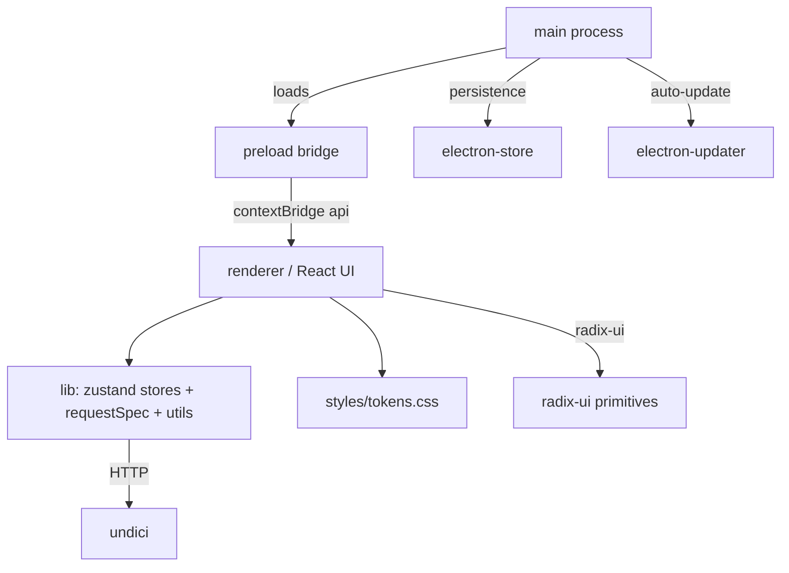

# Architecture — mintenvoy

> Commands named in backticks (e.g. `constitute`, `onboard`) are invoked with the `/` prefix in Claude Code (e.g. `/constitute`).
>
> **Project**: mintenvoy — see the project primer (`CLAUDE.md`) for stack facts (language, framework, build/lint/typecheck commands) and, for multi-package projects, the `## Packages` table with per-package detail. This file captures architectural **decisions, rules, and flow** — the "why" behind the setup, not the "what".

---

## Architectural Decisions

_Populated by `constitute` — records WHY decisions were made, not just what. Format: **Decision** — rationale + tradeoffs considered._

## Layer Boundaries & Dependency Rules

_Populated by `constitute` (for new/greenfield projects — chosen patterns) or `onboard` (for brownfield projects — extracted from existing code). Documents which layers exist, what imports from what, and which directions are forbidden._

### Renderer — UI Primitives Layer (established by feature 001-ui-primitives)

The renderer process has a three-sublayer structure beneath feature components:

| Sublayer                 | Contents                                                                                                                                                                                                                                                                                                                                                                     | Path                                     |
| ------------------------ | ---------------------------------------------------------------------------------------------------------------------------------------------------------------------------------------------------------------------------------------------------------------------------------------------------------------------------------------------------------------------------- | ---------------------------------------- |
| Presentation — atoms     | Inline SVG `Icon` component + typed `IconName` string-literal union over the project-owned 40-icon set; `EmptyPanel` shared "Panel not yet available" placeholder atom                                                                                                                                                                                                                                                                       | `src/renderer/src/components/atoms/`     |
| Presentation — molecules | `Dropdown`, `Modal`, `Toast` — thin wrappers over Radix UI primitives, styled via semantic classes. `Tabs` — controlled selection-only tab-strip; hand-rolled WAI-ARIA engine (see Patterns § below for the departure rationale). `Divider` — hand-rolled WAI-ARIA splitter (domain-agnostic; used by `PaneSplit`). `CodeEditor` — domain-agnostic self-contained edit/preview toggle code editor: a controlled `editing` boolean (owned by `BodyEditor`) conditionally mounts EITHER a plain `<textarea>` (edit) XOR an aria-hidden highlighted `<pre>` (preview) beside a line-number gutter — never both; `--code-line-h` CSS var single-sources the 20.625px line-box height across the gutter and whichever content layer is mounted; highlighting runs synchronously on switch-to-preview via a `{value,lang}` snapshot-cache `useMemo` (gated to preview, so it never recomputes per keystroke); edit entry is via the toggle control, a caret-at-click on the preview, or Enter/Space — all focus the freshly-mounted textarea (focus-on-mount effect keyed on `editing`) — and exit is via textarea blur or the toggle; `resetKey` prop is an opaque reset signal (scroll reset on the mounted layer); reuses `jsonTokens.compose()` unchanged; consumed by `BodyEditor` (`resetKey={activeTabId}`, `editing`/`onEditingChange`), reusable by future body organisms.                                                          | `src/renderer/src/components/molecules/` |
| Presentation — organisms | `Shell` (root composition layer), `Titlebar`, `Statusbar`, and `PaneSplit` — grouped under `organisms/shell/` (app-shell domain). `Sidebar`, `TabBar`, `RequestBar`, `RequestSubTabs`, `KVTable`, and `BodyEditor` — flat domain singletons directly under `organisms/`. `RequestSubTabs` receives its Params and Headers panel content as slot props from the App composition root (never a direct organism import — §2.2). `BodyEditor` receives its urlencoded panel via a render-prop slot (`renderUrlencoded`) wired at the App composition root — the render-prop carries `body.urlencoded.rows` and the write callback so `KVTable` imports stay in App only (§2.2; see Patterns §). Organisms compose molecules/atoms; they never import across the same tier.                                                                     | `src/renderer/src/components/organisms/` |
| Support — lib/ (thin)    | `toastStore` (zustand queue + imperative `toast()` API), `settingsStore` (zustand SSOT for theme/accent/mstyle/sidebarWidth/paneRatio/sidebarCollapsed + clamp helpers), `icons-glue` (Icon lookup/fallback), shared `cx()` className helper, `httpMethods` (ordered `METHODS` tuple + `HttpMethod` union — method SSOT consumed by `requestSpec`, `RequestBar`, and `Tabs`), `varTokens` (pure display-only `{{var}}` tokeniser — stateless, renderer-isolated, no resolution), `jsonTokens` (renderer-pure two-pass tokeniser: JSON structural pass + `{{var}}` overlay with var-pass-wins inside strings; used by CodeEditor for the code-area highlight), `envVars` (∅-default frozen-sentinel selector for the active environment's valid variable names — T14 seam; see Patterns §) | `src/renderer/src/lib/`                  |

**Dependency direction**: organisms import from molecules and atoms; molecules and atoms import from lib/; `lib/` must NOT import from `components/`. No sibling-tier imports (an organism must not import a sibling organism). All intra-renderer imports use the `@renderer` alias — no deep relative paths across sublayer boundaries.

**Overlay substrate**: Radix `radix-ui` unified package owns focus-trap, keyboard navigation, and positioning for Dropdown/Modal/Toast. The project adds only what Radix does not provide (the toast queue, Icon, and styling).

**Toast queue pattern**: a single module-level zustand `toastStore` owns the toast stack (enqueue, auto-dismiss, manual-dismiss, hover/focus-pause). `Toast.tsx` renders the store's queue via Radix `Toast.Root`/`Toast.Viewport`. A single `ToastProvider` + `ToastViewport` is mounted once at the App root (`App.tsx`) — multiple instances would split the queue.

**Shell app-state pattern**: a single module-level zustand `settingsStore` is the SSOT for all shell view state. `Shell.tsx` is the sole writer of `document.documentElement` data-attributes (`data-theme`, `data-accent`, `data-mstyle`) and CSS custom properties (`--sidebar-width`, `--pane-ratio`); the `Divider` also writes these same CSS vars during live drag at rAF cadence. No additional component sets these attrs or vars directly.

**Working-tabs state machine pattern**: a single module-level zustand `tabsStore` owns the open-request tab list (`tabs: Tab[]`, array order = visual order), the active tab pointer (`activeTabId`), and the full lifecycle — `openFromCollection` (id-then-url two-leg dedupe), `newBlank`, `close` (never-zero: spawns a replacement when the last tab closes; right-then-left neighbor selection when the active tab closes), `selectActive`, `markClean(tabId)`, and `updateActiveSpec(patch)` (shallow-merges a partial `RequestSpec` patch into the active tab's spec; no-op when every key already equals the current value, so the dirty flag is never flipped spuriously), and `setActiveSubTab(tabId, key)` (sets the active sub-tab for the given tab; validates `key` against `VALID_KEYS` and no-ops on unknown `tabId` — mirrors `markClean`'s guard pattern). The `Tab` record carries an additive `activeSubTab: SubTabKey` field (type `'params'|'auth'|'headers'|'body'|'tests'|'code'`, default `'params'`) — per-tab state so each request tab restores its own sub-tab independently when the user switches away and back. `TabBar` is the lifecycle subscriber — it wires `openFromCollection`, `newBlank`, `close`, and `selectActive` to the Tabs molecule. `RequestBar` is the spec-edit subscriber — it reads the active tab's `method`, `url`, and `dirty` fields via per-field selectors and writes them back via `updateActiveSpec`; Save calls `markClean`. `RequestSubTabs` is the sub-tab-state subscriber — it reads `activeSubTab` via a scalar selector and writes changes via `setActiveSubTab`. The never-zero invariant is a construction-time guarantee: the store initialises with one seeded blank tab and `close` always spawns a replacement before removing the last entry. `requestSpec.ts` is a pure data module in lib/ — exports types only (`RequestSpec`, `Row`, `Auth` discriminated union, `isBearerAuth` type guard, `Body` tagged record `{active: BodyType; raw: RawBody; urlencoded: UrlencodedBody}` and its sub-types) and seed factories (`makeBlankRequest()`, `BLANK_BODY`); it carries no actions and no store state (constitution §3.1 / §4). `tabsStore` re-exports the `Body` types and `BLANK_BODY` so components (BodyEditor) never import `requestSpec` directly (AC-13, §5.2). `BodyEditor` writes body changes via `updateActiveSpec({ body })` — a full-`Body` patch carrying all three fields so the store's reference-equality dirty guard fires correctly. The always-present `raw` and `urlencoded` sub-records on every `Body` value retain each mode's entered content while `active` switches — the store is the single SSOT for mode-value round-trip.

**Styling**: semantic class names bound to `tokens.css` CSS custom properties; no inline styles. Per-component CSS files live alongside the component under `atoms/`, `molecules/`, and `organisms/`.

## Data Flow

_Populated by `onboard` (for brownfield — scan findings) or by tech-writer as features are built. Captures how data moves through the system end-to-end._

## Cross-cutting Concerns

_Populated as relevant: authentication/authorization approach, error propagation strategy, logging/observability, transaction boundaries, caching strategy, feature flagging. Filled in by `constitute` or discovered by `onboard`._

## Testing

### Renderer Test Stack

Renderer test stack: Vitest + @testing-library/react + user-event (jsdom) for interaction tests; Playwright component tests (`@playwright/experimental-ct-react`) for real-browser focus/keyboard fidelity.

- **Unit / interaction tests**: `vitest run` — configured in `vitest.config.ts` at the repo root; environment is `jsdom`; globals enabled; setup file imports `@testing-library/jest-dom` matchers; `@renderer` alias mirrors `electron.vite.config.ts`.
- **Component tests (real browser)**: `playwright test -c playwright.config.ts` — configured in `playwright.config.ts`; uses `@playwright/experimental-ct-react` to mount components in Chromium for keyboard/focus fidelity.
- Test files live under `src/renderer/src/**/*.{test,spec}.{ts,tsx}` (Vitest) and `src/renderer/src/**/*.ct.{ts,tsx}` (Playwright CT).
- No test infrastructure exists for the main or preload processes; add if needed.

**Hazard: Radix overlay CT — click-outside must wait for listener readiness.** `DismissableLayer` (the dismiss engine inside Radix Dropdown, Modal, and similar overlay primitives) defers its `pointerdown` handler via `setTimeout(0)`. A `page.mouse.click` issued before that macrotask executes silently misses the listener and the overlay stays open — producing intermittent false-pass failures. The required gate before any outside click in a Radix overlay CT: (1) await all overlay animations to finish; (2) yield one `setTimeout(0)` macrotask boundary to arm the listener. Step 1 is a no-op under `prefers-reduced-motion: reduce` (no animations run), but step 2 alone suffices to arm the listener in that case. Apply this two-step gate to every Playwright CT that dismisses a Radix overlay (Dropdown, Modal, and any future Tooltip, Popover, or Select CTs).

<!-- src/renderer/src/components/molecules/__tests__/Dropdown.ct.tsx:198-201 -->

```typescript
await menu.evaluate((el) => Promise.all(el.getAnimations().map((a) => a.finished)))
// Macrotask-boundary readiness floor: guarantees Radix DismissableLayer's
// setTimeout(0)-deferred pointerdown listener has fired (not a fixed delay).
await page.evaluate(() => new Promise((resolve) => setTimeout(resolve, 0)))
```

## Architecture Overview

mintEnvoy is a single-window Electron desktop API client split across the three canonical Electron processes. The **main** process (src/main) owns the BrowserWindow and app lifecycle: it constructs a 900x670 window wired to the preload bundle, defers show until ready-to-show, routes window-open requests to the system browser, and enables electron-vite HMR in development. The **preload** bridge (src/preload) is the only contextIsolation-safe channel between main and renderer, exposing the @electron-toolkit electronAPI plus a project api object; the renderer never touches Node or Electron directly.

The **renderer** (src/renderer) holds the entire React 19 UI and is itself layered. Components follow atomic design — atoms (Icon), molecules (Divider, Dropdown, Modal, Tabs, Toast, CodeEditor), and organisms (RequestBar, RequestSubTabs, KVTable, TabBar, Sidebar) composed by an app shell (Titlebar, Sidebar, PaneSplit, Statusbar under Shell). Cross-component state lives in module-level zustand stores under lib/ (tabsStore for the working-tabs lifecycle, toastStore for the notification queue, settingsStore for shell view state), alongside a renderer-only request domain model (requestSpec) and pure helpers. Styling is fully token-driven: every component binds to CSS custom properties in the generated styles/tokens.css.

Dependencies flow one way — renderer components depend on lib/ (stores, model, utils), lib/ depends on nothing renderer-visual, and the main and preload processes never import renderer code. Third-party integration is thin and purposeful: undici for outbound HTTP, electron-store for local persistence, electron-updater for auto-update, and radix-ui for accessible overlay primitives. The whole app is bundled by electron-vite and packaged per-OS by electron-builder.

## Module / Package Structure

```text
src/
├── main/                      # Electron main process
│   └── index.ts               # Window creation + app lifecycle
├── preload/                   # contextIsolation-safe IPC bridge
│   ├── index.ts               # electronAPI + project api exposure
│   └── index.d.ts             # Renderer-visible bridge types
└── renderer/
    ├── src/
    │   ├── components/         # Atomic-design UI
    │   │   ├── atoms/          # Icon
    │   │   ├── molecules/      # Divider, Dropdown, Modal, Tabs, Toast, CodeEditor
    │   │   └── organisms/      # RequestBar, RequestSubTabs, KVTable, TabBar, Sidebar
    │   │       └── shell/      # Titlebar, Sidebar, PaneSplit, Statusbar, Shell
    │   ├── lib/                # zustand stores, requestSpec model, pure utils
    │   ├── App.tsx             # Composes Shell + single ToastProvider
    │   └── main.tsx            # React root mount
    └── styles/
        └── tokens.css         # Generated design tokens (from tokens.json)
```

## Patterns

### cx className merge

**Applies in**: All renderer components composing conditional class lists

Join class tokens through the shared cx() helper instead of open-coding [...].filter(Boolean).join(' '); falsy tokens drop out so conditional classes stay declarative.

<!-- src/renderer/src/lib/cx.ts:18 -->
```typescript
export function cx(...classes: Array<string | false | null | undefined>): string {
  return classes.filter(Boolean).join(' ')
}
```

### Render-prop slot injection for parameterized cross-organism composition

**Applies in**: App.tsx (composition root) wiring BodyEditor's urlencoded slot

When an organism needs a sibling organism as a live-binding child — parameterized by the parent's own state — pass it via a render-prop slot, not a static `ReactNode`. A static node cannot carry bindings owned by the injecting parent; the render-prop receives those values as arguments at call time. The injecting component (KVTable) stays in App.tsx only, enforcing §2.2 (no sibling-organism import). The render-prop and its inner component are defined at module scope so the function reference is stable — preventing unnecessary re-renders through memo boundaries.

<!-- src/renderer/src/App.tsx:38-41 -->
```typescript
const renderUrlencodedKVTable = (
  rows: readonly Row[],
  onRowsChange: (r: Row[]) => void
): React.JSX.Element => <UrlencodedKVTable rows={rows} onRowsChange={onRowsChange} />
```

### Seed-factory for store data

**Applies in**: tabsStore working-tabs lifecycle (and requestSpec via makeBlankRequest)

New store entities are minted by a pure factory that stamps a fresh crypto.randomUUID() and delegates nested shapes to their own factories, so no two blank entities share an id and defaults live in one place.

<!-- src/renderer/src/lib/tabsStore.ts:173 -->
```typescript
function makeBlankTab(): Tab {
  return {
    id: crypto.randomUUID(),
    collectionRequestId: null,
    spec: makeBlankRequest(),
    dirty: false,
    activeSubTab: 'params'
  }
}
```

## Conventions

**Naming**
- Components in PascalCase files (RequestBar.tsx), each paired with a same-name .css (RequestBar.css).
- lib utilities and stores in camelCase files (tabsStore.ts, httpMethods.ts, varTokens.ts).
- zustand stores suffixed 'Store' (tabsStore, toastStore, settingsStore).

**File Organization**
- Renderer components bucketed by atomic-design tier: atoms / molecules / organisms (+ organisms/shell).
- Co-located tests under a sibling __tests__/ dir; *.test.tsx (unit), *.ct.tsx (Playwright CT), *.stories.tsx (gallery).
- Renderer state, domain model, and pure helpers live under lib/.

**Import Style**
- Cross-module renderer imports use the @renderer/* path alias, never deep relative chains.
- Same-directory CSS imported side-effect-only at the top of its component (import './RequestBar.css').

**Error Handling**
- Renderer-pure helpers graceful-degrade rather than throw (e.g. envVars returns an empty set, never null/undefined).
- External-boundary logic (window-open, IPC) validates before acting; internal code is trusted.

**Styling**
- Styling is plain per-component CSS files bound entirely to design-token CSS custom properties from tokens.css.
- Values are never hand-authored as literals in component CSS; tokens.css is regenerated from design/tokens.json.
- Theme and mode are selected via data-theme / data-mstyle attributes on <html>.

**State Management**
- Shared renderer state lives in module-level zustand stores instantiated once per module (never per-consumer).
- Components subscribe via per-field selectors, not full-store subscriptions, to bound re-renders.
- State mutates only through store actions; data shapes stay plain and JSON-serializable.

## Layers

- Main process — Window creation, app lifecycle, native OS wiring; src/main/
- Preload bridge — contextIsolation-safe IPC surface exposed to the renderer; src/preload/
- Renderer UI — React atomic-design components + app shell; src/renderer/src/components/
- Renderer domain/state — zustand stores, request domain model, pure helpers; src/renderer/src/lib/
- Design tokens — Generated CSS custom properties consumed by all components; src/renderer/styles/

## Cross-Cuts

### Design tokens

Every component binds color, surface, border, and text to CSS custom properties defined once in tokens.css (generated from design/tokens.json). Themes switch at runtime via data-theme / data-mstyle on <html>; components never hard-code hex values.

<!-- src/renderer/styles/tokens.css:8 -->
```css
:root {
  --accent: #10b981;
  --bg: #fbfaf9;
  --bg-elev: #ffffff;
  --border: #e8e6e3;
  --text: #18181b;
  --text-muted: #6c6c75;
}
```

### Variable-placeholder tokeniser

RequestBar and KVTable render {{variable}} placeholders through one display-only tokeniser that splits text into plain/var segments. It never resolves values (resolution is out of scope), so the overlay stays character-identical to the backing input.

<!-- src/renderer/src/lib/varTokens.ts:61 -->
```typescript
export function tokenizeVars(text: string): VarSegment[] {
  const segments: VarSegment[] = []
  const pattern = /\{\{(.*?)\}\}/gs
  let lastIndex = 0
  let match: RegExpExecArray | null
  while ((match = pattern.exec(text)) !== null) {
    const name = match[1].trim()
    if (match.index > lastIndex) segments.push({ kind: 'plain', text: text.slice(lastIndex, match.index) })
    segments.push(name.length > 0 ? { kind: 'var', name, raw: match[0] } : { kind: 'plain', text: match[0] })
    lastIndex = match.index + match[0].length
  }
  if (lastIndex < text.length) segments.push({ kind: 'plain', text: text.slice(lastIndex) })
  return segments
}
```

## Dependency Direction Rules

- Renderer components depend on lib/ (stores, model, utils); lib/ never imports components.
- Renderer modules are node/electron-free — no cross-import into main or preload.
- main and preload never import renderer code; the preload bridge is the only main-renderer channel.
- Every component depends on tokens.css via CSS custom properties, never on hard-coded values.

## Dependency Overview


```mermaid
graph TD
    main[main process] -->|loads| preload[preload bridge]
    preload -->|contextBridge api| renderer[renderer / React UI]
    renderer --> lib[lib: zustand stores + requestSpec + utils]
    renderer --> tokens[styles/tokens.css]
    renderer -->|radix-ui| radix[radix-ui primitives]
    lib -->|HTTP| undici[undici]
    main -->|persistence| store[electron-store]
    main -->|auto-update| updater[electron-updater]
```
